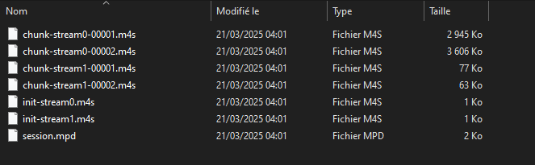
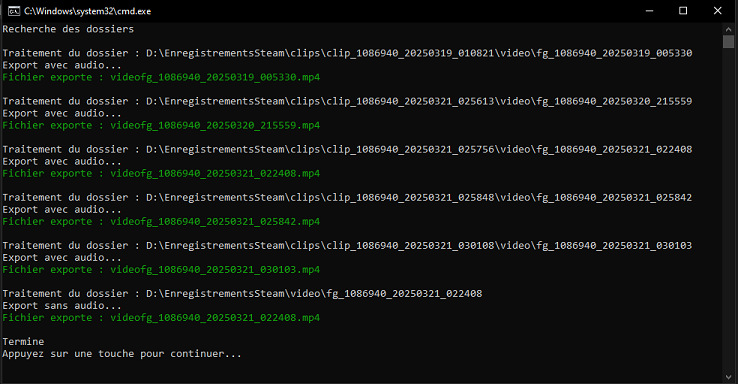
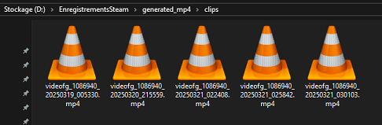

[🇬🇧 EN version](README_EN.md)

# 🎮 SteamClipExporter - Script de Conversion Automatique des Clips Steam

## ⚙️ Prérequis
- **Windows** (le script est conçu pour Windows, une version shell pourrait être développée pour Linux)
- **FFmpeg installé** ([Voir le guide d'installation](docs/installation_ffmpeg.md))

## 📌 Mais pourquoi faire ?
Steam permet l'enregistrement de vidéos de gameplay, mais les fichiers générés sont difficiles à utiliser et nécessitent steam ou un outil de conversion pour être directement lisibles.

Vous pouvez paramétrer le dossier de sauvegarde des enregistrements dans les paramètres de Steam. J'ai choisi de les enregistrer dans un dossier `EnregistrementsSteam`. Le contenu de ce dossier ressemble à ceci:

Si on regarde le contenu de ces dossiers, on trouve des fichiers `.m4s` qui sont des fragments de vidéos. Par exemple, pour un clip de 30 secondes, on peut avoir de nombreux fichiers `.m4s` qui ne sont pas directement lisibles sur notre machine, comme dans l'exemple ci-dessous:

Ce script permet de convertir automatiquement les clips enregistrés par Steam au format `.mp4`, afin de les rendre exploitables dans n'importe quel logiciel de montage vidéo.

🔹 Ce script `.bat` utilise `FFmpeg` pour reconstruire les vidéos en `.mp4` sans perte de qualité.

---

## 📅 Installation
1. **Télécharger le script** depuis le dépôt GitHub :warning: Choisissiez la version adaptée à votre configuration de FFmpeg ([avec ou sans ajout au PATH](docs/installation_ffmpeg.md))
2. **Placer le fichier `.bat`** dans le dossier contenant les enregistrements Steam (chez moi j'ai nommé le dossier EnregistrementsSteam)

## 🎮 Utilisation

1. **Double-cliquer** sur le fichier `.bat`
2. Le script détecte et convertit automatiquement les clips et vidéos des sous dossiers

3. Les fichiers `.mp4` générés sont placés dans un dossier `generated_mp4`

4. Si une vidéo a déjà été convertie, le programme le sautera et ne s'occupera que des nouvelles vidéos

1. Une fois le script terminé, vous pouvez retrouver les vidéos converties dans le dossier `generated_mp4` dans leurs dossier respectifs

---

## ⚙️ Configuration avancée
🔹 **Personnalisation des dossiers d'export**
   - Par défaut, les `.mp4` sont enregistrés dans `generated_mp4` à côté du script.
   - Vous pouvez modifier la variable `EXPORT_ROOT` dans le fichier `.bat`.

🔹 **Changement de la langue des logs**
   - Le script affiche les logs en français par défaut. 
   - Vous pouvez changer la langue en modifiant la variable `set "LANG=FR"` ou `set "LANG=EN"` dans le fichier `.bat`.

🔹 **Mode accessibilité visuelle**
   - Un mode d'accessibilité visuelle est disponible pour désactiver les couleurs des logs et améliorer la lisibilité.
   - Il est désactivé par défaut (`set "COLORBLIND=0"`).
   - Pour l'activer, modifiez la valeur par `set "COLORBLIND=1"` dans le fichier `.bat`.

🔹 **Options avancées FFmpeg**
   - Le script utilise `-c:v copy` pour éviter de réencoder la vidéo.
   - Vous pouvez modifier les paramètres dans le fichier `.bat` pour modifier la qualité vidéo/audio.

⚠️ **Attention** Ne renommez pas les fichiers générés ni les fichiers et dossiers générés par steam.
Le script utilise leur nom pour détecter automatiquement si une vidéo a déjà été convertie.
Vous pouvez cependant copier les `.mp4` exportés ailleurs, ou supprimer les clips depuis l’interface de Steam sans problème.

## 📚 Documentation complémentaire
- 🎥 [Utilisation de l'enregistrement Steam](docs/steam_recording.md)
- 🛠 [Dépannage et FAQ](docs/troubleshooting.md)