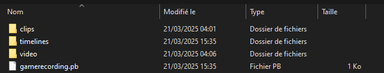
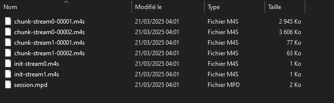
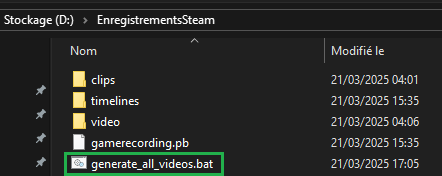
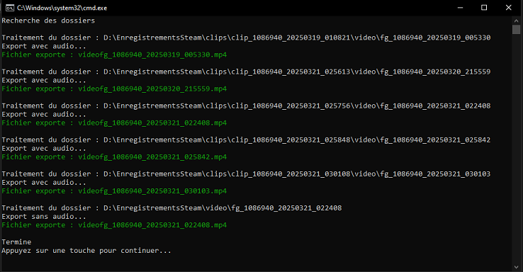
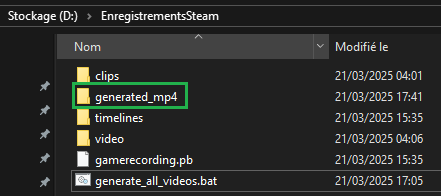
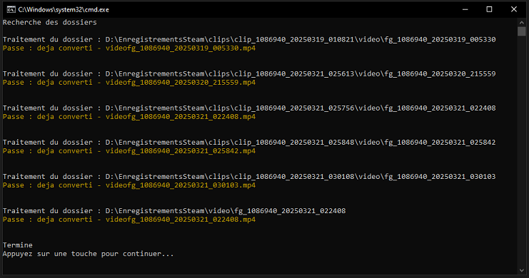
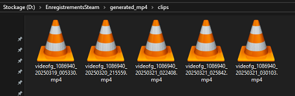

[🇫🇷 Version française](README.md)

# 🎮 SteamClipExporter - Automatic Steam Clips Conversion Script

## ⚙️ Prerequisites
- **Windows** (this script is designed for Windows; a shell version could be developed for Linux)
- **FFmpeg installed** ([See installation guide](docs/installation_ffmpeg.md))

## 📌 But why?
Steam allows gameplay recording, but exporting to `.mp4` can only be done manually through the Steam interface and only one clip at a time.

This script automatically converts Steam-recorded clips to `.mp4` format without having to open them one by one in Steam.

You can configure the save folder for recordings in Steam's settings. I chose to save them in a folder named `EnregistrementsSteam`. Here's what the folder looks like:

If you look inside those folders, you’ll find `.m4s` files, which are video fragments. For example, a 30-second clip may contain many `.m4s` files that are not directly readable on your machine, as shown below:

🔹 This `.bat` script uses `FFmpeg` to rebuild `.mp4` videos with no quality loss.

---

## 📅 Installation
1. **Download the script** from the GitHub repository :warning: Choose the version adapted to your FFmpeg setup ([with or without PATH addition](docs/installation_ffmpeg.md))
2. **Place the `.bat` file** in the folder containing your Steam recordings (in my case, the folder is named `EnregistrementsSteam`)

## 🎮 Usage

1. **Double-click** the `.bat` file
2. The script will automatically detect and convert all clips and videos inside subfolders

3. The generated `.mp4` files will be placed in a folder named `generated_mp4`

4. If a video has already been converted, it will be skipped and only new videos will be processed

5. Once the script is done, you'll find the converted videos in the `generated_mp4` folder, sorted by type

---

## ⚙️ Advanced Configuration
🔹 **Custom export folder**
   - By default, `.mp4` files are saved in `generated_mp4` next to the script.
   - You can change the `EXPORT_ROOT` variable inside the `.bat` file.

🔹 **Log language**
   - Logs are displayed in French by default.
   - You can switch to English by setting `set "LANG=EN"` in the `.bat` file.

🔹 **Visual accessibility mode**
   - A visual accessibility mode disables colored log messages for better readability.
   - It’s disabled by default (`set "COLORBLIND=0"`).
   - To enable it, change it to `set "COLORBLIND=1"`.

🔹 **Advanced FFmpeg options**
   - The script uses `-c:v copy` to avoid re-encoding the video.
   - You can tweak the settings in the `.bat` file to adjust video/audio quality.

⚠️ **Warning**  
Do not rename the generated files or the files and folders created by Steam.  
The script relies on their names to detect whether a video has already been converted.  
However, you can move the exported `.mp4` files elsewhere or delete the clips from Steam’s interface without any issues.

## 📚 Additional Documentation
- 🎥 [Using Steam Recording](docs/steam_recording.md)
- 🛠 [Troubleshooting and FAQ](docs/troubleshooting.md)
