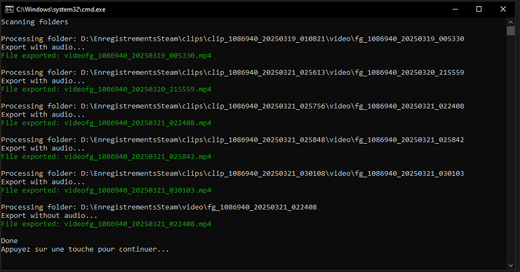
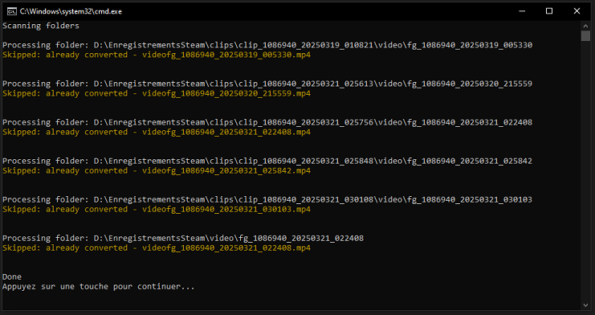

[🇫🇷 Version française](README.md)

# 🎮 SteamClipExporter - Automatic Steam Clips Conversion Script

## ⚙️ Prerequisites
- **Windows** (this script is designed for Windows, but a shell version could be developed for Linux)
- **FFmpeg installed** ([See installation guide](docs/installation_ffmpeg_EN.md))

## 📌 But why?
Steam allows you to record gameplay videos, but the generated files are difficult to use and require Steam or a conversion tool to be directly readable.

You can configure the save folder for recordings in the Steam settings. I chose to save them in a folder named `EnregistrementsSteam`. Here's what the content of this folder looks like:

If we look inside those folders, we find `.m4s` files, which are video fragments. For example, a 30-second clip might contain many `.m4s` files that are not directly readable, as shown below:

This script automatically converts Steam-recorded clips to `.mp4` format, making them usable in any video editing software.

🔹 This `.bat` script uses `FFmpeg` to rebuild `.mp4` videos without any quality loss.

---

## 📅 Installation
1. **Download the script** from the GitHub repository
2. **Place the `.bat` file** in the folder containing your Steam recordings (in my case, I named it `EnregistrementsSteam`)

## 🎮 Usage

1. **Double-click** the `.bat` file
2. The script will automatically detect and convert all clips and videos inside subfolders

1. The generated `.mp4` files will be placed in a `generated_mp4` folder

4. If a video has already been converted, the script will skip it and only process new ones

1. Once the script is done, you can find the converted videos inside the `generated_mp4` folder, sorted by type

---

## ⚙️ Advanced Configuration
🔹 **Customizing export folders**
   - By default, `.mp4` files are saved in `generated_mp4` next to the script.
   - You can modify the `EXPORT_ROOT` variable inside the `.bat` file.

🔹 **Changing the log language**
   - The script logs messages in French by default.
   - You can switch the language by setting `set "LANG=FR"` or `set "LANG=EN"` in the `.bat` file.

🔹 **Visual accessibility mode**
   - A visual accessibility mode is available to disable colored log messages for better readability.
   - It is disabled by default (`set "COLORBLIND=0"`).
   - To activate it, change the value to `set "COLORBLIND=1"` in the `.bat` file.

🔹 **Advanced FFmpeg options**
   - The script uses `-c:v copy` to avoid re-encoding the video.
   - You can tweak the settings inside the `.bat` file to adjust video/audio quality.

⚠️ **Warning** Do not rename the generated files or the files and folders created by Steam.
The script relies on their names to detect whether a video has already been converted.
However, you can copy the exported `.mp4` files elsewhere or delete the clips using Steam's interface without any issue.

## 📚 Additional Documentation
- 🎥 [Using Steam Recording](docs/steam_recording_EN.md)
- 🛠 [Troubleshooting and FAQ](docs/troubleshooting_EN.md)

