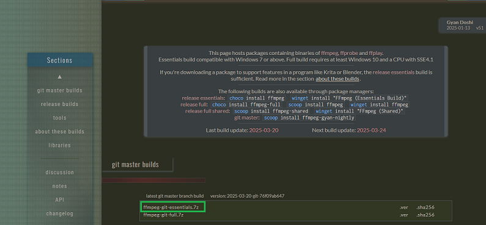
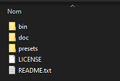
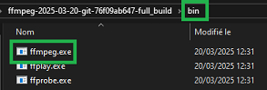

[🇬🇧 EN version](installation_ffmpeg_EN.md) | [⬅️ Retour au guide principal](../README.md)

# 🛠 Téléchargement de FFmpeg (Windows)

Ce script repose sur l'utilisation de [FFmpeg](https://ffmpeg.org/), un outil gratuit et open source permettant de manipuler des fichiers audio et vidéo.

---

## 1. Téléchargement de FFmpeg

1. Rendez-vous sur le site officiel : [https://ffmpeg.org/download.html](https://ffmpeg.org/download.html)  
2. Cliquez sur **Windows** et choisissez l’un des sites de compilation (par exemple, [Gyan.dev](https://www.gyan.dev/ffmpeg/builds/))


3. Téléchargez la version que vous souhaitez : **essentials** ou **full** (par exemple : `ffmpeg-release-full.7z`)



4. Décompressez l'archive à l'emplacement de votre choix (certaines versions sont doublement compressées, il faudra donc extraire deux fois jusqu'à obtenir le dossier `ffmpeg` qui contient `bin`, `doc`, etc.).



5. Le fichier `ffmpeg.exe` se trouve dans le dossier `bin`



---

## Option 1 - Utilisation sans modification du PATH

Si vous préférez cette solution, vous devrez utiliser la version du fichier `.bat` adaptée à cette configuration disponible [ici](../SteamClipExporter_noPath.bat).

Si vous préférez ne pas modifier vos variables d'environnement, vous pouvez aussi placer `ffmpeg.exe` dans **le même dossier que le script `.bat`**. Le script pourra alors l'exécuter sans avoir besoin du `PATH`.

---

## Option 2 - Installation manuelle avec ajout au PATH

1. Extrayez l'archive à l'emplacement de votre choix (par exemple `C:\Program Files\ffmpeg`)
2. Ouvrez le dossier `ffmpeg`, puis `bin`
3. Vérifiez que le fichier `ffmpeg.exe` est bien présent dans ce dossier

### Ajouter FFmpeg au PATH système

1. Dans Windows, ouvrez le menu **Démarrer**, tapez `variables d'environnement` et ouvrez la fenêtre correspondante
2. Dans la section "Variables système", sélectionnez la variable `Path` puis cliquez sur **Modifier**
3. Cliquez sur **Nouveau** et entrez le chemin vers le dossier `bin` de FFmpeg (ex. `C:\Program Files\ffmpeg\bin`)
4. Cliquez sur **OK** pour valider

### Vérification de l'installation

1. Ouvrez une invite de commandes (touche Windows + R > `cmd`)
2. Tapez la commande suivante :
```bat
ffmpeg -version
```
3. Si FFmpeg est correctement installé, la version apparaîtra dans le terminal


