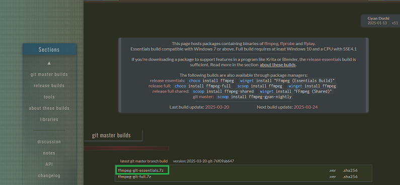
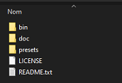

[🇫🇷 Version française](installation_ffmpeg.md) | [⬅️ Back to main guide](../README_EN.md)

# 🛠 Downloading FFmpeg (Windows)

This script relies on [FFmpeg](https://ffmpeg.org/), a free and open-source tool for processing audio and video files.

---

## 1. Downloading FFmpeg

1. Go to the official website: [https://ffmpeg.org/download.html](https://ffmpeg.org/download.html)  
2. Click on **Windows** and choose one of the build providers (for example, [Gyan.dev](https://www.gyan.dev/ffmpeg/builds/))


3. Download the version you prefer: **essentials** or **full** (e.g. `ffmpeg-release-full.7z`)



4. Extract the archive to the location of your choice. Some versions are double-compressed, so you may need to extract twice until you get the `ffmpeg` folder containing `bin`, `doc`, etc.



5. The `ffmpeg.exe` file is located in the `bin` folder


---

## Option 1 – Using Without Modifying the PATH

If you choose this method, you must use the version of the `.bat` script adapted for this setup, available [here](../SteamClipExporter_noPath.bat).

If you prefer not to change your environment variables, you can place `ffmpeg.exe` in **the same folder as the `.bat` script**. The script will then be able to run it without relying on the system `PATH`.

---

## Option 2 – Manual Installation with PATH Setup

1. Extract the archive to a location of your choice (e.g. `C:\Program Files\ffmpeg`)
2. Open the `ffmpeg` folder, then the `bin` folder
3. Make sure the file `ffmpeg.exe` is present in that folder

### Add FFmpeg to the System PATH

1. In Windows, open the **Start menu**, type `environment variables`, and open the matching window
2. Under the "System variables" section, select the `Path` variable and click **Edit**
3. Click **New** and enter the path to the FFmpeg `bin` folder (e.g. `C:\Program Files\ffmpeg\bin`)
4. Click **OK** to confirm

### Verify the Installation

1. Open a Command Prompt (Windows + R > `cmd`)
2. Type the following command:
```bat
ffmpeg -version
```
3. If FFmpeg is properly installed, its version will be displayed in the terminal